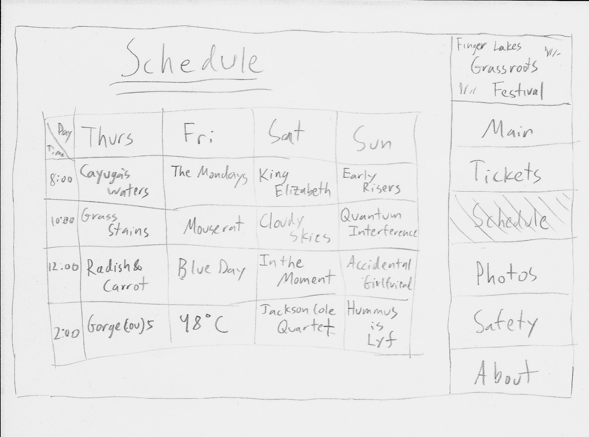

# Project 1 - Design Journey

**For each milestone, complete only the sections that are labeled with that milestone.**

## Markdown Instructions

This is a Markdown file. All written documents that you will submit this semester will be Markdown files. Markdown is a commonly used format by developers and bloggers. It's something that you should know.

The following links are Markdown references:
- <https://guides.github.com/features/mastering-markdown/>
- <https://github.com/adam-p/markdown-here/wiki/Markdown-Cheatsheet>

When writing your Markdown file in Atom. Open the command palette and search for **Markdown Preview: Toggle**. This will open up a panel in Atom where you can preview your formatted Markdown file.

This is how your insert images into your Markdown documents:

## Milestone 1

**Make the case for your decisions using concepts from class, as well as other design principles, theories, examples, and cases from outside of class.**

You can use bullet points and lists, or full paragraphs, or a combo, whichever is appropriate. The writing should be solid draft quality but doesn't have to be fancy.

### Website Topic (Milestone 1)
I am planning on designing a personal homepage that showcases my skills and experiences as a student and athlete thus far.

### Target Audience (Milestone 1)

The intended audience is for job recruiters that are looking for someone with experience is web design and/or experience using HTML and CSS because this is a great way for me to show the web design skills I learn in this class, while also including easy access to all the information that they need when looking at your portfolio. It is also very easy to update and touch up on things to make it look more aesthetically pleasing as I learn more throughout this course.

### Final Content (Milestone 1)

I plan on including an introduction, a cover letter, any recommendations from previous jobs, and any other things that I want to highlight that may or may not be on my resume/cover letter. It may also be useful to include pictures and include things you are passionate about, so they can get to know you on a personal and professional level.

### Home Page Content (Milestone 1)

There should be an introduction with my name and picture, because often times people like to put a name to a face. The introduction should clearly state your most current achievements and involvements, while not going into too much depth.

The homepage should also include a side bar of some sort, that will take them to several things that they may want to see such as a resume and cover letter. The homepage is the first impression they will get of you, so it  is also important that the style is unique to you and creates some sort of brand for yourself.

---

## Milestone 2

**Make the case for your decisions using concepts from class, as well as other design principles, theories, examples, and cases from outside of class.**

Each section is probably around 1 reasonably sized paragraph (2-4 sentences).

### Target Audience (Milestone 2)

The audience still stands as job recruiters. They will want to see a cover letter and resume, but also any recommendations you have from other jobs. They would also want to know about you personally and what is important to you. Since I have no experience in web programming, this is a good way for me to showcase my talents, but also let my personality shine.

### Organization & Navigation (Milestone 2)

I have attached an image of how I plan to create my navigation. Originally, I had the cover letter and resume as links at the bottom of the page, but that is probably  the first thing that recruiters want to see so I decided to put it in the navigation. I will keep the contact me information at the bottom of the webpage, but will put it on every page that I make, so that it can be accessed from every page. I also decided to add recommendations and give them a label within that navigation page as an added extra. I also needed to add more personal things, so I decided to create a navigation page for extracurriculars. The two big ones I have included is the charity event I organized over the summer and my hobby of filming and video editing.

### Final Organization and Navigation (Milestone 2)

The final organization will make everything visible on the home page and other pages, so that they can have direct and easy access to what they are able to view from any page that they are on. There are many things that recruiters have to process and go through, so they will be happy to have easy access to everything.

---

## Milestone 3

**Make the case for your decisions using concepts from class, as well as other design principles, theories, examples, and cases from outside of class.**

Remember to focus on the things we can't see just by looking at the site: changes, alternatives considered, processes, and justifications.

Each section is probably around 1 reasonably sized paragraph (2-4 sentences).

### Theme Ideas (Milestone 3)

For my target audience, it is important that the style is not the main thing that stands out because the content is what's more important. Organization is the most important feature that is needed in this webpage, however it is important that the webpage has some personality to it. The theme should compliment the content, not over power it. I'm not exactly sure what colors will be able to get the right idea across, but I plan to play around with colors and fonts that fit best.

### Theme Design (Milestone 3)

For theme 1, I decided to make the font the center of the theme, making it easy to read, but also making it quirky. I think it helps bring out personality without being "too much." The tones of pink I chose were very subtle and the contrast helps highlight the important points. I personally think that the color contrast is great, but the choice of colors do not really contribute to conveying the message meant for the message and makes it a little unprofessional

For theme 2, I wanted to make a more general theme, that looks professional and easy to read. I think the colors and fonts feel a lot more professional, but lack personality. I could maybe change the colors of the titles and have a more subtle color of the background. I think overall, this theme is more suitable for the audience.

Overall, I think I can combine styles from both themes to find the perfect match and maybe focus more on color of title and less on the background titles.

## Final Submission - Rationale

**This rationale should be polished writing: one you might submit as a report to a client or boss to help explain the project and convince them you did a good job. You'll be surprised how much writing and communicating you need to do about projects and choices on internships and jobs; practice that here.**

It should be a comprehensive, complete story of the project. You might find that each section runs a few paragraphs (1-2). Sketches can often help tell the story of your design. Screenshots are also useful for describing issues discovered during the design process and how you addressed them.

Your rationale should be a polished version of the earlier explanations.

### Site Layout (Final Submission)

While the changes do not drastically represent the constant changes I made to the website, I will point out a few major changes that I made with each page.

In the index page, I originally had everything centered and required scrolling down the page and then I formatted it to reduce scrolling and make the design look more organized.

I decided not to change much on the resume and cover letter pages because the point is only to display those things and not distract my audience from them, so I just made the font bigger and made it a point that it is something they should view.

On the recommendations page, I added a couple images to provide more first glance information. If my job experience isn't relevant to what I am getting recruited for, they may not want to waste their time looking at something that isn't relevant. The images tell them the company and the position I had at the time of the internship and a description of when it was.The more specific, the better.

On the extracurriculars page, I used flex box to format the pictures in rows, to again reduce scrolling and improve the organization of the content.

Now the contacts page was a last minute addition as I originally intended to just list my contact information at the bottom of every page, but decided this was no efficient for every page because it worked better for pages that had more content and not very well for pages with limited content. If it were at the bottom of the page it might get missed. The contacts navigation is now available on every page in the nav bar, so that no scrolling or re-navigation to the home page is necessary.

### Audience (Final Submission)

The intended audience for my project is future job recruiters. There are key things that recruiters look for when looking for potential employees. Recruiters often have to go through 100s of applications, so creating a website that makes it easy for recruiters to access all of the information will be a plus one when your application comes around to be reviewed.

Also, writing is limiting in letting a recruiter know the type of person that you are. People are very receptive to visual representation and a webpage is a good way to show different aspects of your personality while also showing your web design skills. This is a big plus when applying to a job that requires skill in HTML and CSS!

### Design Goals (Final Submission)

My design goals were to create a website where the recruiters viewing my site can easily see and access all the information that they need. I knew that the layout and navigation was going to be the main focus of my styling because I want my recruiters to be impressed at how easy it is to access all of my documents.

Of course visual design is also important in making it look professional, but not having to scroll to far to get certain information or having a lot of white space in order to access information is important with formatting in this case because you do not want the recruiter to miss anything.It was also important to style the website in a way that will make it easier for me to go back and add to later.

### Navigation (Final Submission)

I was happy with my navigation by the final product because it looks very visually appealing and matches the theme of my website very well. At the end, I decided to add another navigation tag for contacts so that it is right there, seen, and easily accessible from every page which is the main point of importance for my audience.

All of the links on my navigation work and are styled correctly on each page. At first I did not know where I was going with the navigation, but eventually spaced it out and formatted in a way that was almost exact to what I had envisioned.

### Organization (Final Submission)

This goes hand in hand with my design goals. I needed everything to have the correct formatting to be organized and have a way of being able to be changed later. I was also important that every element fit into its proper space.

In particular, I did not add much to the resume and cover letter pages because I wanted to focus on the content that is suppose to be seen there and not draw attention away from it by adding graphics to fill the page. On the recommendations page in particular, I added pictures that were relevant to the letter and a recruiter can see from first glance where it is I worked, and what I did there.Overall the organization is clean and does and makes everything accessible.

### Visual Design (Final Submission)

My main goals for the visual design was to make it look professional, while also showing my personality. I want recruiters to look at this and see more into me than what my resume and cover letter tell them.

I also think it's important that this is something that impresses recruiters not so much in a way where it comes off as showing off, but in a way that they say "wow" to themselves because of the content and organization.

### Self-Reflection (Final Submission)

I learned that to make something quality like this it takes time. CSS could be very confusing at first, but once you play around with it you learn more and more and more, eventually getting the hang of things.

I think one of my biggest weaknesses it planning out my design because I have to play around with a lot of different features before I can decide was looks best and what will flow the best with my content. This requires changing my html and css a lot, taking up more time than I should.

My biggest strength however is organization. Even though it might take me a bit longer, I am very picky about how things should be formatted, trying to get it down to perfect according to my plans.
